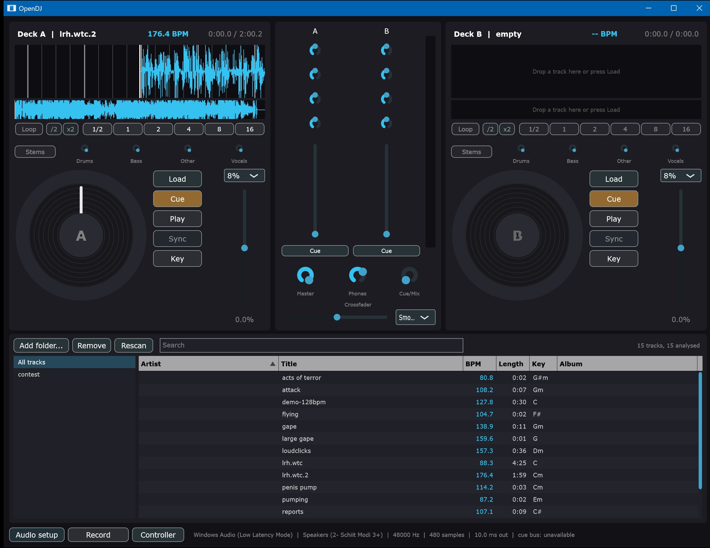

# OpenDJ

| Branch | Build and tests |
| --- | --- |
| [`main`](https://git.interdo.me/interdome/opendj/actions?workflow=build.yml&branch=main) | [](https://git.interdo.me/interdome/opendj/actions?workflow=build.yml&branch=main) |
| [`testing`](https://git.interdo.me/interdome/opendj/actions?workflow=build.yml&branch=testing) | [](https://git.interdo.me/interdome/opendj/actions?workflow=build.yml&branch=testing) |

Each badge is a build and the full test suite on Fedora and Debian, and goes red if either
fails. Windows has no CI job: the only runner available was a desktop somebody works on, and a
build landing on it every push made that machine unusable. It is checked by building and testing
there directly, which is what has caught things in practice.

The badge itself only ever says "build", because Gitea labels it with the workflow name and
offers no way to change that, so the branch is named beside it.

Free and open source DJ software, built in C++ with [JUCE](https://juce.com).



The goal is an application a VirtualDJ user can sit down at and already know how to use:
the same deck layout, the same workflow, the same muscle memory. The artwork, the naming
and the code are entirely original and entirely open.

**Status: early development, but it mixes.** Two decks with turntable platters you can scratch,
waveforms, beat grids, automatic BPM and key detection, sync, key lock, beat-locked loops and
rolls, stem separation with a knob per stem, a mixer with a filter per channel, hot cues, a
searchable track library, set recording with a tracklist, and Roland DJ-202 support including its
own audio interface and its platters. No effects or sampler yet.

## Design goals

- **Real audio performance.** ASIO and JACK support, multi-device routing, and a realtime
  safe engine that never allocates or locks on the audio thread.
- **Hardware first.** A data-driven MIDI mapping layer with the Roland DJ-202 as the
  reference controller. Mappings are JSON files, so a new controller needs no recompile.
- **Free, in both senses.** GPLv3, no paid tier, no locked features.

## Roadmap

See [ROADMAP.md](ROADMAP.md) for what is done, what is left, and where to start. The short
version: everything in the first milestone now works. Effects, loops, a sampler and four decks
are the next things worth having.

## Using it

Load a track from the library underneath, with the Load button on either deck, by dragging an
audio file in from a file manager, or by naming files on the command line to start with them
already loaded. Decoding
and analysis run in the background, so the interface stays responsive on a long file. Click the
overview waveform to move through the track.

Each deck shows a scrolling waveform with the beat grid drawn over it, bar lines brighter than
beats, and the detected tempo next to the title. Sync matches this deck's tempo and beat phase
to the other one.

The platter turns at 33 1/3 rpm against the track position, so it is a readout and not
decoration: if it is crawling, the deck is crawling. Drag the middle of it to scratch, exactly
as if you had a hand on the record, and drag the outer ring to nudge the pitch without stopping
playback. The rim flashes on every beat, which is a second way to see two decks drifting apart
without reading the waveforms.

Key lock is the `Key` button on each deck. With it on, the tempo fader changes the speed and
leaves the pitch where the record put it; it steps out of the way while you have a hand on the
platter, because a time stretcher cannot follow a scratch and nobody expects a scratch to be in
key.

| Key | Action |
| --- | --- |
| Q / W | Deck A cue / play |
| O / P | Deck B cue / play |

Cue follows the behaviour DJs expect. While the deck is stopped, pressing cue sets the cue
point and previews from it, and releasing returns and stops. While it is playing, pressing
cue drops straight back to the cue point and stops there.

## The library

Point OpenDJ at a folder with **Add folder** and it reads the tags of everything inside, which
takes seconds rather than minutes because it parses ID3 directly instead of opening a decoder
for every file. It then works through the collection in the background, at low priority, finding
the tempo and beat grid of each track and remembering it, so a track you load later is on the
deck immediately instead of being analysed again.

Search matches every word you type against the artist, title, album and path, so `boys noize
2007` narrows as you would expect. Click a column to sort, double-click a row to load it onto a
deck that is not playing, or drag it onto the deck you meant.

The database is a single SQLite file, in `~/.config/OpenDJ` on Linux. Deleting it costs you the
analysis and nothing else.

Tempo detection was checked against 60 tracks from a 13,000 track techno collection, and agrees
with Mixxx on 57 of them; [ROADMAP.md](ROADMAP.md) has the detail and the method.

## Recording a set

Press Record in the bottom bar. The master output goes to a 24-bit WAV in your music folder
under OpenDJ, named for the date and time, and the button turns red and counts up while it
runs. Press it again to stop.

Beside the audio you get a text file listing what you played and when, timed against the
recording rather than the clock. Whatever was already playing when you pressed Record is the
first entry.

If the disk cannot keep up, the recording loses those samples rather than the room losing
audio, and you are told: in the status bar while it happens, in the dialog when you stop, and
in the tracklist file, which is the one still there tomorrow.

## Controllers

Press Controller in the bottom bar to pick a MIDI device and a mapping, and to watch what the
hardware is actually sending. Every message is listed with the control it matched, or as
unmapped, which is how you check a mapping against real hardware or work out what an
unsupported controller sends.

Mappings are JSON files in `mappings/`, not code. Copy one, change the numbers, and your
controller works without rebuilding anything. A control with a mistake in it is skipped with a
warning shown in that panel, so one typo costs you one button rather than the whole device.

A recognised controller is opened automatically at startup.

## Building

You need a C++20 compiler, CMake 3.22 or newer, and git. JUCE and Catch2 are fetched into
`external/` at configure time, so the first configure needs a network connection and takes a
few minutes.

### Linux

One script covers Fedora, Debian and Arch. It installs the right packages for whichever
package manager it finds, then builds.

```
scripts/build.sh --deps     # install system dependencies, once
scripts/build.sh            # configure and build
scripts/build.sh --run      # and launch it
```

On **Fedora** the dependencies are:

```
sudo dnf install -y \
    gcc-c++ cmake ninja-build git pkgconf-pkg-config \
    alsa-lib-devel pipewire-jack-audio-connection-kit-devel sqlite-devel \
    freetype-devel fontconfig-devel \
    libX11-devel libXext-devel libXinerama-devel \
    libXrandr-devel libXcursor-devel libXcomposite-devel \
    mesa-libGL-devel
```

Fedora 40 and newer route JACK through PipeWire, so the package above is the one to install
rather than `jack-audio-connection-kit-devel`; the two conflict. On an older release, or a
system deliberately running classic JACK, swap it for `jack-audio-connection-kit-devel`. The
build script picks whichever is available.

For low latency, run OpenDJ through JACK or PipeWire rather than plain ALSA, and pick that
device in Audio setup. PipeWire presents itself as a JACK server, so nothing extra is needed
on a stock Fedora desktop.

### Windows

Visual Studio 2022 Build Tools with the C++ workload provides everything. Its bundled CMake
and Ninja are found and used automatically, so nothing else has to be installed.

```
pwsh scripts/build.ps1         # configure and build
pwsh scripts/build.ps1 -Test   # and run the tests
pwsh scripts/build.ps1 -Run    # and launch it
```

### Any platform, by hand

```
cmake -S . -B build -DCMAKE_BUILD_TYPE=RelWithDebInfo
cmake --build build --parallel
```

### ASIO on Windows

ASIO is off by default because Steinberg's SDK cannot be redistributed. Download it
yourself, then configure with:

```
cmake -S . -B build -DOPENDJ_ENABLE_ASIO=ON -DOPENDJ_ASIO_SDK_PATH=C:/path/to/asiosdk
```

Without it the app uses WASAPI, which is fine for development but not for a live set.

## Running the tests

```
ctest --test-dir build --output-on-failure
```

## Roland DJ-202 notes

The DJ-202 is a two-deck controller with a built-in four-channel USB audio interface, which
maps directly onto OpenDJ's master-on-1-2 and cue-on-3-4 routing.

Mapped so far: play, cue, sync, key lock, headphone cue, the tempo faders, trim, all three EQ
bands, the channel faders, the crossfader, browse, load, shift, the platters in both scratch and nudge modes, and
the eight pads per deck as hot cues. Shift plus a pad clears that hot cue. Touching the metal
top of a platter halts playback and drives it from your hand at 33 1/3 rpm; moving the outer
ring instead nudges the pitch and decays back to the fader.

Not yet mapped: the deck-toggle button and decks 3 and 4, the effects section, the TR-S
sequencer, slip and vinyl mode, key lock, and the pad modes past hot cue.

**One thing still needs checking against real hardware:** the tempo faders are mapped inverted,
on the assumption the DJ-202 sends its highest value at the bottom of the throw. If yours reads
backwards, set `"inverted": false` on the two tempo fader entries in the mapping file. The
Controller panel's monitor shows the raw values, so it takes about ten seconds to confirm.

Set the unit's USB mode to match your platform. On Windows use **Vendor** mode with Roland's
driver installed, which gives you ASIO. On Linux use **Generic** mode, which is USB class
compliant and works with ALSA and JACK with no driver at all.

The control assignments were derived from Roland's MIDI implementation chart and cross
checked against the [Mixxx community mappings](https://github.com/mixxxdj/mixxx/wiki/Roland-Dj-202)
for the DJ-202 and the closely related DJ-505. Those mappings are GPLv2 or later and so are
compatible with this project; they are credited in the header of `mappings/roland-dj-202.json`.

## Licence

GPLv3 or later. See [LICENSE](LICENSE).

OpenDJ is not affiliated with, endorsed by, or derived from Atomix Productions, Roland
Corporation, or Serato. Product names are trademarks of their respective owners and are used
only to describe hardware and file compatibility.
